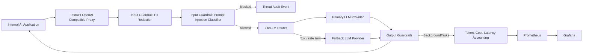

# LLM Shield & Observability Gateway

## Executive Summary

LLM Shield is an open-source, production-oriented API gateway for companies adopting generative AI at scale. It reduces LLM operating risk by masking sensitive data before it reaches external providers, blocking prompt-injection attempts before execution, routing traffic across model vendors with fallback policies, and exposing cost and latency telemetry for financial control.

The project is intentionally OpenAI-compatible: existing applications can point their `/v1/chat/completions` traffic to the gateway with minimal client changes. In the included deterministic evaluation set, the prompt-injection guardrail reaches **1.000 F1-score**; in production, the same boundary can be upgraded to a local Hugging Face classifier such as `protectai/deberta-v3-base-prompt-injection-v2`.

## Architecture Diagram



## Production Tech Stack

| Technology | Why it is used |
| --- | --- |
| FastAPI | High-performance async I/O, strong typing, native BackgroundTasks, and excellent OpenAPI support. |
| Pydantic v2 / Pydantic Settings | Strict request validation and environment-driven configuration without leaking secrets. |
| LiteLLM | Provider abstraction for OpenAI, Anthropic, Cohere, and other LLM APIs behind one router. |
| Microsoft Presidio | Enterprise-grade PII detection and anonymization for privacy and compliance programs. |
| Hugging Face Transformers | Optional local prompt-injection classifier for low-latency security inference. |
| Prometheus / Grafana | Operational metrics for latency, cost, redactions, request volume, and blocked threats. |
| PostgreSQL-ready persistence boundary | The telemetry layer is isolated so production deployments can persist audit records asynchronously. |
| Docker Compose | One-command local stack for API, database, metrics, and dashboards. |
| GitHub Actions | Repeatable linting, tests, guardrail evaluation, and Docker image build on every push. |

## Request Flow

1. A client sends an OpenAI-compatible `POST /v1/chat/completions` request.
2. LLM Shield validates the consumer API key.
3. The PII guardrail masks emails, CPFs, cards, phone numbers, and Presidio-supported entities.
4. The prompt-injection guardrail blocks jailbreak attempts before any provider call is made.
5. LiteLLM sends the sanitized request to the configured primary model and falls back on provider errors.
6. Output guardrails inspect the response for unsafe content and malformed structured output.
7. The safe response is returned to the client.
8. FastAPI `BackgroundTasks` records token usage, cost, latency, redaction counts, and threat metrics without adding user-facing latency.

## Guardrails Evaluation Metrics

The repository includes `tests/evaluate_guardrails.py`, a compact release-gate evaluation script that computes classic security-classifier metrics.

| Metric | Value |
| --- | ---: |
| True Positives | 3 |
| False Positives | 0 |
| True Negatives | 3 |
| False Negatives | 0 |
| Precision | 1.000 |
| Recall | 1.000 |
| F1-Score | 1.000 |

The default evaluation uses deterministic examples so CI remains stable. Production deployments can enable `LLM_SHIELD_ENABLE_TRANSFORMER_GUARD=true` to use a local Transformer classifier and expand the evaluation dataset with organization-specific attack traffic.

## Quick Start

Create a `.env` file from the example, add provider credentials, and start the full stack:

```bash
cp .env.example .env
docker-compose up --build
```

The services will be available at:

| Service | URL |
| --- | --- |
| LLM Shield API | `http://localhost:8080` |
| Prometheus | `http://localhost:9090` |
| Grafana | `http://localhost:3000` |

Default Grafana credentials are `admin` / `admin`.

## Example Request

```bash
curl -X POST http://localhost:8080/v1/chat/completions \
  -H "content-type: application/json" \
  -H "x-api-key: dev-proxy-key" \
  -d '{
    "model": "openai/gpt-4o-mini",
    "messages": [
      {"role": "user", "content": "Summarize this note for jane.doe@example.com"}
    ],
    "temperature": 0.2
  }'
```

## Configuration

| Variable | Purpose |
| --- | --- |
| `LLM_SHIELD_API_KEYS` | Comma-separated API keys allowed to call the proxy. |
| `LLM_SHIELD_PRIMARY_MODEL` | Primary LiteLLM model identifier. |
| `LLM_SHIELD_FALLBACK_MODELS` | Comma-separated backup model identifiers. |
| `LLM_SHIELD_OPENAI_API_KEY` | OpenAI API key for LiteLLM. |
| `LLM_SHIELD_ANTHROPIC_API_KEY` | Anthropic API key for fallback routing. |
| `LLM_SHIELD_DATABASE_URL` | Async database URL reserved for audit persistence. |
| `LLM_SHIELD_ENABLE_TRANSFORMER_GUARD` | Enables local Hugging Face prompt-injection inference. |
| `LLM_SHIELD_PROMPT_INJECTION_MODEL` | Transformer model used by the injection classifier. |

## Development

```bash
python -m venv .venv
source .venv/bin/activate
pip install -r requirements.txt
ruff check src tests
pytest
python tests/evaluate_guardrails.py
```

## Security Notes

- Secrets are read from environment variables and are never returned in error payloads.
- Global exception handlers return stable JSON errors instead of Python stack traces.
- Prompt-injection blocks are recorded as security events through the telemetry boundary.
- PII masking runs before any upstream provider call.

## License

This project is released as open-source software under the MIT License.
